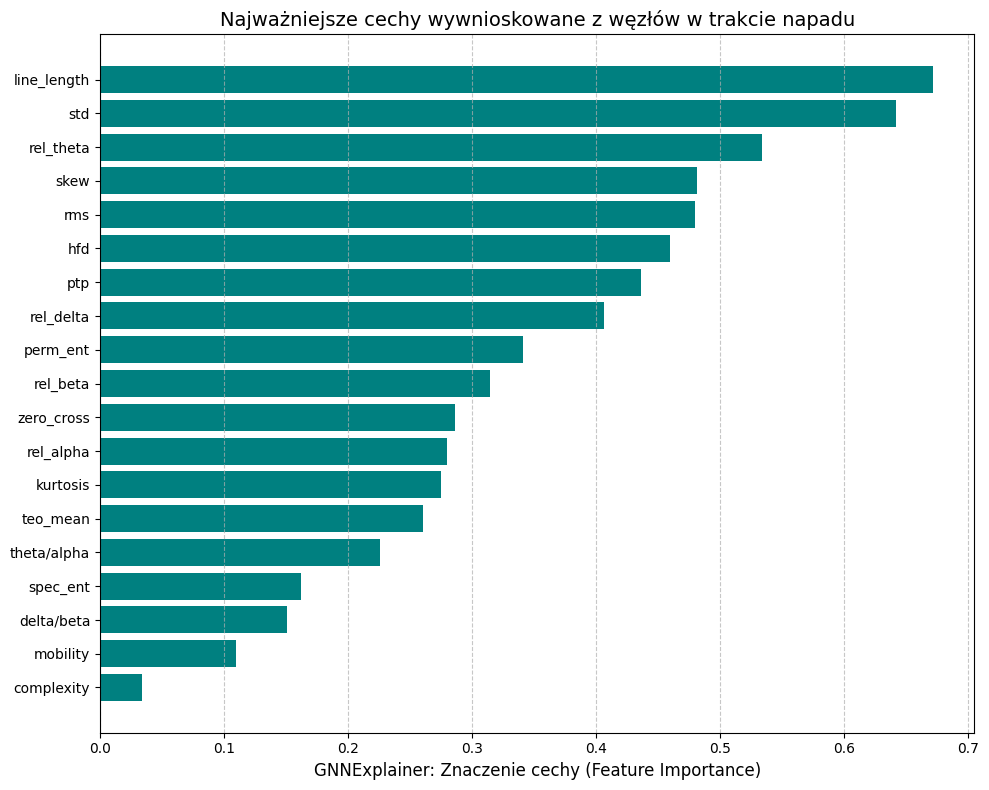
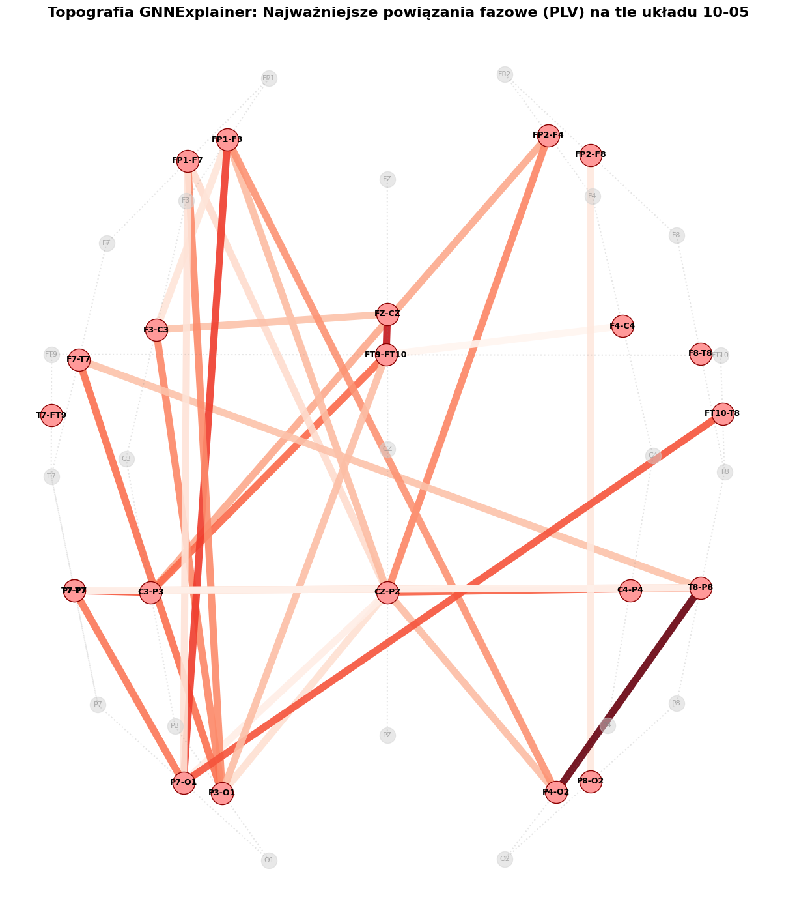
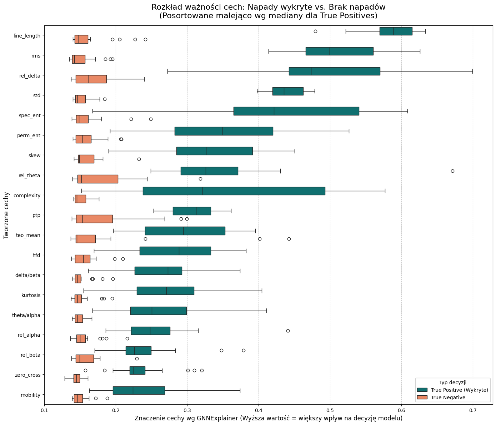
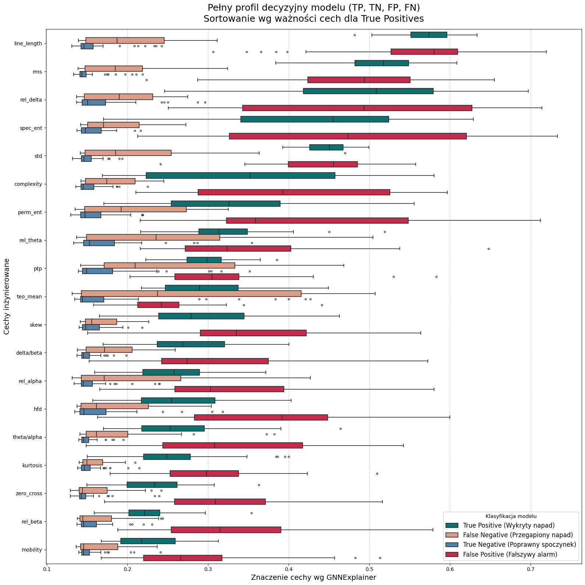

# Wyjaśnialność Grafowych Sieci Neuronowych w zadaniu detekcji napadów padaczkowych za pomocą sygnału EEG i ręcznie tworzonych cech.

**Autor:** Szymon Stano, nr indeksu: 268776

**Temat:** Numer 5 — Explainability - wyjaśnialność modelu

**Kurs:** Aspekty prawne, społeczne i etyczne w AI, PWr 2025/2026

> Lista tematów: [Zasady zaliczenia — Menu mini-projektów](https://github.com/laugustyniak/ai-ethics-law-course/blob/main/Zasady%20zaliczenia.md#menu-mini-projekt%C3%B3w)

---
## Wymagania i uruchomienie

W pierwszej kolejności należy pobrać zbiór **CHB-MIT Scalp EEG Database** z https://physionet.org/content/chbmit/1.0.0/ i umieścić go w folderze projektu w następujący sposób:

```text
ai-ethics-law-mini-project/
└── data/
    └── chb-mit/
        ├── chb01/
        ├── chb02/
        ├── chb03/
        ├── ...
```

Następnie zalecane jest użycie środowiska wirtualnego (Python 3.12.3):
```bash
python -m venv venvs
source venv/bin/activate

pip install -r requirements.txt
```
Aby uruchomić preprocessing danych oraz trening modelu należy uruchomić komendę
```bash
bash run_experiments.sh
```
Analiza wyjaśnialności wytrenowanego modelu:
```bash
jupyter notebook notebooks/xai.ipynb
```

---

## Cel projektu

Celem projektu jest ewaluacja wyjaśnialności Grafowej Sieci Neuronowej (ChebConv) w zadaniu detekcji napadów padaczkowych z wykorzystaniem sygnału EEG oraz inżynierii cech charakterystycznych dla tej choroby. Ewaluowany jest wpływ i istotność tworzonych cech w zależności od decyzji modelu, jak również wizualizowana jest istotność krawędzi pomiędzy elektrodami dla wybranych próbek napadowych. W tym celu użyto metody GNNExplainer. 

## Powiązanie z projektem grupowym

Nasz projekt n-w opiera się o analizie wyjaśnialności modeli uczenia głębokiego w zadaniu detekcji padaczki. Co odróżnia od niego ten mini-projekt to zastosowanie sieci grafowych (GNN) oraz handcrafted features charakterystycznych dla tej choroby, zamiast bezpośrednich embeddingów temporalnych.

## Wyniki

### 📊 Wyniki klasyfikacji modelu na danych testowych

| Klasa | Precision | Recall | F1-Score | Support |
| :--- | :---: | :---: | :---: | :---: |
| **Non-Ictal** | 0.94 | 0.99 | 0.97 | 6846 |
| **Ictal** | 0.97 | 0.76 | 0.85 | 1757 |
| | | | | |
| **Accuracy** | | | **0.95** | 8603 |
| **Macro Avg** | 0.96 | 0.88 | 0.91 | 8603 |
| **Weighted Avg** | 0.95 | 0.95 | 0.94 | 8603 |

**🎯 Detection AUROC (Non-Ictal vs Ictal):** `0.9483`


### Wyjaśnialność

*Wyjaśnienie lokalne (jedna próbka napadowa)*



Dla danej próbki możemy zaobserwować któe z cech były najbardziej istotne dla decyzji modelu (napad). 




Zwizualizowaną również mamy istotność krawędzi, która sugeruje iż lokalizacja napadu znajdowała się po lewej stonie mózgu.


*Wyjaśnienie globalne (wiele próbek z różnych kategorii)*



Powyższy wykres weryfikuje poprawność logiki bazowej modelu dla wielu próbek. Wyraźnie widać, że w stanie spoczynkowym (TN) sieć słusznie ignoruje cechy związane ze złożonością i energią sygnału (np. line_length, rms) i żadna z nich nie ma przeważającego wpływu na decyzję od innych. Dopiero w momencie napadu (TP) uwaga modelu drastycznie przenosi się na te kluczowe, zgodne z medyczną wiedzą biomarkery.



Zestawienie wszystkich klas może pokazywać, skąd biorą się błędy modelu. Fałszywe alarmy (FP) wyglądają dla algorytmu dokładnie tak samo jak prawdziwe napady (TP). Oznacza to, że sieć działa logicznie, ale daje się "oszukać" fizycznym zakłóceniom – ruch pacjenta czy mruganie naśladują prawdziwy atak w sygnale EEG. Z kolei przegapione napady (FN) to efekt tzw. uczenia na skróty (shortcut learning). Model zamiast patrzeć na kluczowe cechy napadu, rozprasza się i podejmuje decyzję na podstawie jednego błędnego sygnału (np. nienaturalnego skoku cechy teo_mean).


## Wnioski merytoryczne

Powyższa analiza wskazuje na to, że wyjaśnialność modeli uczenia głębokiego może prowadzić do spójnych wyników i budzić wstępne zaufanie do decyzji modelu. Jednakże żeby w pełni zewaluować zachowanie takiego modelu, jego stabilność i decyzje, potrzebna jest znacznie większa liczba eksperymentów i dokładniejsza analiza, szczególnie trudnych przypadków.

## Ograniczenia

- Głębsza analiza ważności krawędzi i topologii mózgu (np jaki rodzaj napadu, lokalizacja)
- Dokładniejsze przyjrzenie się ważności węzłów/elektrod (dobry byłby do tego zbiór TUSZ, gdzie część próbek zawiera adnotacje odnośnie tego, na których dokładnie kanałach napad jest widoczny, a nie tylko to czy jest obecny)
- Dalsza ewaluacja przypadków false positives i false negatives - dlaczego model akurat w nich przywiązał podobne wagi do prawdziwych klasach?
- Perturbacje wag modelu, ewaluacja stabilności modelu poprzez dodanie nieznaczego szumu do cech, protokół Co-12, etc.

## Źródła

- [CHB-MIT Scalp EEG Database](https://physionet.org/content/chbmit/1.0.0/) — zbiór danych
- [Convolutional Neural Networks on Graphs with Fast Localized Spectral Filtering](https://doi.org/10.48550/arXiv.1606.09375) — użyty model GNN (ChebConv)
- [GNNExplainer: Generating Explanations for Graph Neural Networks](https://doi.org/10.48550/arXiv.1903.03894) — użyta metoda wyjaśnialności
- [Graph Neural Network-based EEG Classification: A Survey](https://doi.org/10.48550/arXiv.2310.02152) - przegląd podejść w dziedzinie GNN i EEG
- [Explainable Graph Neural Networks for EEG Classification and Seizure Detection in Epileptic Patients](https://ieeexplore.ieee.org/document/10635821) - publikacja o podobnej tematyce